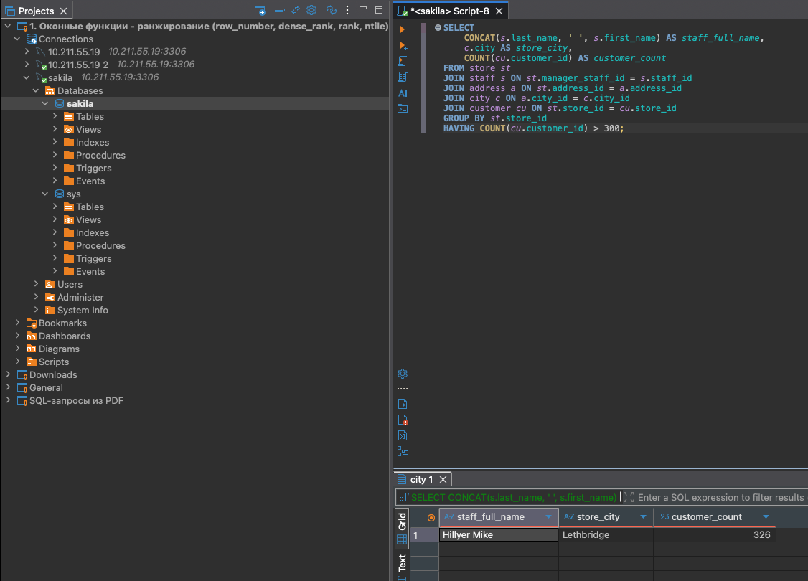
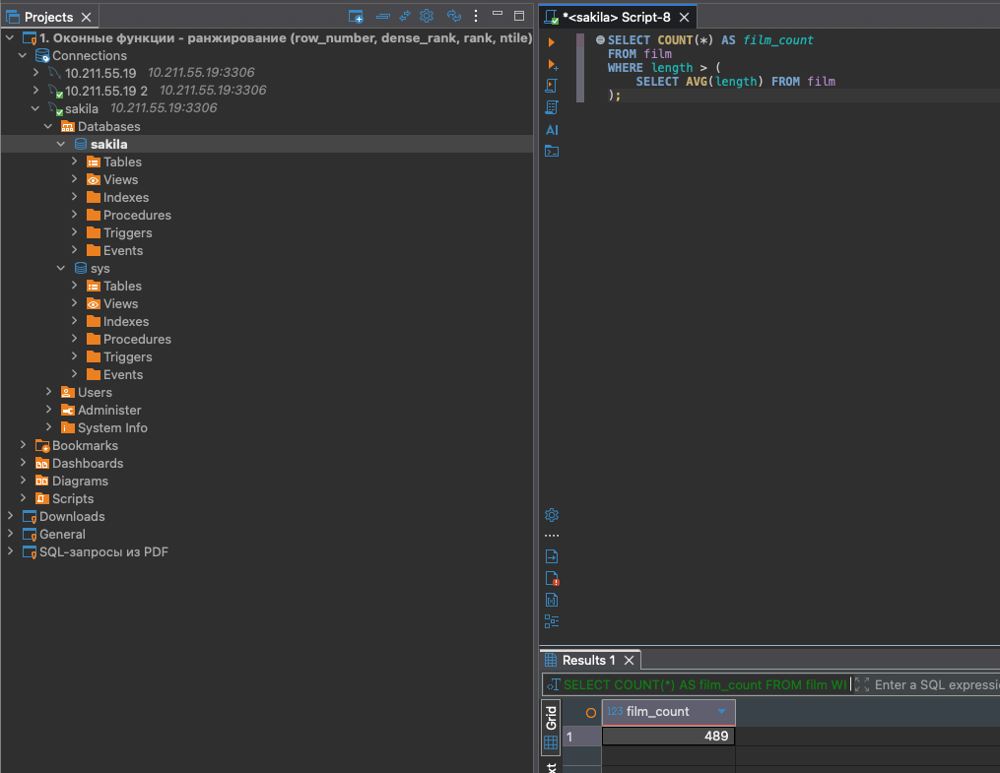
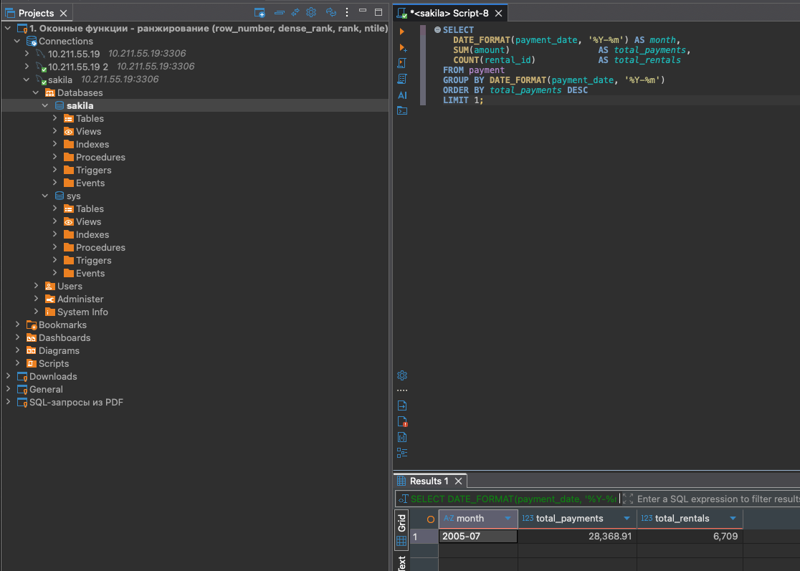

## Задание 1
**Условие:** Получить информацию о магазине, в котором обслуживается более 300 покупателей. Вывести:
- фамилию и имя сотрудника;
- город нахождения магазина;
- количество покупателей.

**SQL-запрос:**
```sql
SELECT
    s.first_name AS staff_first_name,
    s.last_name AS staff_last_name,
    c.city,
    COUNT(cu.customer_id) AS customer_count
FROM store st
JOIN staff s ON st.manager_staff_id = s.staff_id
JOIN address a ON st.address_id = a.address_id
JOIN city c ON a.city_id = c.city_id
JOIN customer cu ON st.store_id = cu.store_id
GROUP BY st.store_id
HAVING COUNT(cu.customer_id) > 300;```



---

## Задание 2
**Условие:** Получить количество фильмов, продолжительность которых больше средней продолжительности всех фильмов.

**SQL-запрос:**
```sql
SELECT COUNT(*) AS film_count
FROM film
WHERE length > (
    SELECT AVG(length) FROM film
);



---

## Задание 3
**Условие:** Получить информацию, за какой месяц была получена наибольшая сумма платежей, и добавить информацию по количеству аренд за этот месяц.

**SQL-запрос:**
```sql
SELECT 
    DATE_FORMAT(payment_date, '%Y-%m') AS month,
    SUM(amount) AS total_payments,
    COUNT(rental_id) AS total_rentals
FROM payment
GROUP BY DATE_FORMAT(payment_date, '%Y-%m')
ORDER BY total_payments DESC
LIMIT 1;


